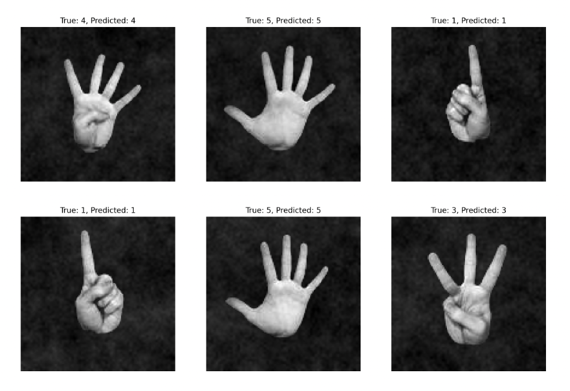
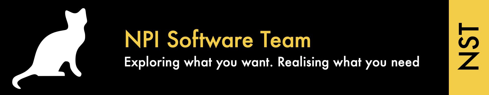

# Codiax 2023 Workshop - Rapid Embedded Prototyping with Machine Learning

- [Pre-workshop instructions](#pre-workshop-instructions)
- [Part 1 - Install dependencies](#part-1---install-dependencies)
    - [Mac](#mac)
    - [Linux](#linux)
    - [Windows](#windows)
- [Part 2 - Test Example](#part-2---test-example)
- [Part 3 - Training](#part-3---training)
  - [3.1 Dataset preparation](#31-dataset-preparation)
  - [3.2 Training your model](#32-training-your-model)
- [Part 4 - Testing](#part-4---testing)
- [Part 5 - Controling the Dyson Air Purifier Fan](#part-5---controling-the-dyson-air-purifier-fan)
  - [Sending MQTT messages](#sending-mqtt-messages)
- [Authors](#authors)

## Pre-workshop instructions
<a name="pre-workshop-instructions"></a>
Follow [Part 1 - Install dependencies](#part-1---install-dependencies) and [Part 2 - Test Example](#part-2---test-example). If this works - you're all set for the workshop!

- If you have python version <= 3.11 and [Part 2 - Test Example](#part-2---test-example) doesn't work, I suggest following the same steps for users with Python > 3.11 in [Part 1 - Install dependencies](#part-1---install-dependencies)

## Part 1 - Install dependencies
<a name="part-1---install-dependencies"></a>

### Mac
<a name="mac"></a>

#### Install Homebrew

Run the code below on your terminal and follow the steps shown during installation: 

```bash
/bin/bash -c "$(curl -fsSL https://raw.githubusercontent.com/Homebrew/install/HEAD/install.sh)"
```
For more information: https://brew.sh

#### Install mosquitto
```bash
brew install mosquitto
```

On a separate terminal, run:
```bash
mosquitto
```

#### Note: For Apple Silicon users (M1 and above)
- Open `requirements.txt` and uncomment lines relating to Apple silicon users

#### For users with Python version <= 3.11 
```
source 1b_setup.sh
```
If successful, skip the installation steps below and, go to the next part: [Part 2 - Test Example](#part-2---test-example)

#### For users with Python version > 3.11
```
brew install curl
```

#### Install pyenv and python dependencies

```bash
source 1a_pyenv_setup.sh
pyenv install 3.10.0
pyenv local 3.10.0
exec "$SHELL" #only run for bash
exec zsh #only run for zsh
```
Running the code below should print `Python 3.10.0`
```bash
python --version
```
If successful run the next step of the set up: 
```
source 1b_setup.sh
```

### Linux
<a name="linux"></a>

#### Install mosquitto
```bash
sudo apt-get install -y mosquitto
sudo apt-get install libffi-dev tk-dev
```

On a separate terminal, run:
```bash
mosquitto
```

#### For users with Python version <= 3.11 
```
source 1b_setup.sh
```
If successful, skip the installation steps below and, go to the next part: [Part 2 - Test Example](#part-2---test-example)

#### For users with Python version > 3.11
```bash
sudo apt install curl
```

#### Install pyenv and python dependencies
```bash
source 1a_pyenv_setup.sh
env PYTHON_CONFIGURE_OPTS="--enable-shared"
pyenv install 3.10.0
pyenv local 3.10.0
exec "$SHELL" #only run for bash
exec zsh #only run for zsh
```

Running the code below should print `Python 3.10.0`
```bash
python --version
```
If successful run the next step of the set up:
```
source 1b_setup.sh
```

### Windows
<a name="windows"></a>

#### Install Windows Subsystem for Linux (WSL) using the Powershell

```Powershell
wsl --install
```

When successfully installed, follow the Linux installation above

## Part 2 - Test Example
<a name="part-2---test-example"></a>
Activate the virtual environment
```bash
source workshop/bin/activate
```
Test that all Python and ML dependencies have been installed correctly by running the test example
```bash
python 2_test_example.py
```
If you see a plot of images similar to below, congratulations! Installation is successful.



## Part 3 - Training
<a name="part-3---training"></a>
### 3.1 Dataset preparation
<a name="31-dataset-preparation"></a>
Using the IDE/File explorer of your choice, look at the images in `mixed-dataset` folder. You will notice folders `0` `1` `2` `3` `4` `5`

- Brainstorm: How can the dataset be made larger easily?

Here's one method I thought of:
```bash
cd mixed-dataset
python dataset_maker.py
```
#### Note: Give the terminal permission to write files

### 3.2 Training your model
<a name="32-training-your-model"></a>
Open `3_train_hand_recognition.py` to see the model architecture (it's a CNN!), and training settings like `epoch`, `batch size`. You can tweak these values and parameters for training the model.

Once you're happy with your `dataset`, you can train your model by running:
```bash
python 3_train_hand_recognition.py
```
Your trained model will be saved in the `models` folder.

## Part 4 - Testing
<a name="part-4---testing"></a>

- Note: ensure `mosquitto` is running somewhere on a different terminal

Open `4_live_hand_recognition.py` and check out the code,  this will make use of OpenCV and your trained ML model for predicting hand gestures. You will have to change the code to use your trained model from the `models` folder.
```bash
python 4_live_hand_recognition.py
```

- Does it predict all hand gestures correctly? Is it worth trying different angles, lighting, other people's hands? The performance can be improved by improving the dataset and/or training the ML model some more.
- On a different terminal, try running `mosquitto_sub -v -t '#'` and see the output

## Part 5 - Controling the Dyson Air Purifier Fan
<a name="part-5---controling-the-dyson-air-purifier-fan"></a>
If you reached this part, then you must be happy with your model's hand gesture recognition, so well done!

Now comes the fun part where we can control an actual device from our hand gestures, in this case a Dyson Air Purifier Fan

Modify the code to change the broker connection to Raspberry Pi's IP address (ask Marco/workshop speaker for the IP)

<!-- Modify the code to send MQTT messages based on the model's prediction. Dyson fans have speeds that can be set from 1 to 10, but we only trained our model to detect hand gestures from 0 to 5.

#### I suggest:
- Multiply the prediction of the model by 2, so a hand gesture of 1 will set the fan to 2, and a gesture of 2 will set the fan to 4, and so on.

#### Bonus task:
- Only control the fan when there is a hand gesture, so taking your hand away from the camera's frame shouldn't change the fan's speed. Good luck! -->

### Sending MQTT messages 
<a name="sending-mqtt-messages"></a>
Topic is ```Dyson-NST-at-codiax``` and message is ```{"speed"}:val``` where ```val``` is a value from 1 to 10
#### Example message to control fan - publish to RPi Local Broker
```
  Dyson-NST-at-codiax {"speed":5}
```

## Authors
<a name="authors"></a>
- Marco Domingo
- NEST (NST Embedded)

